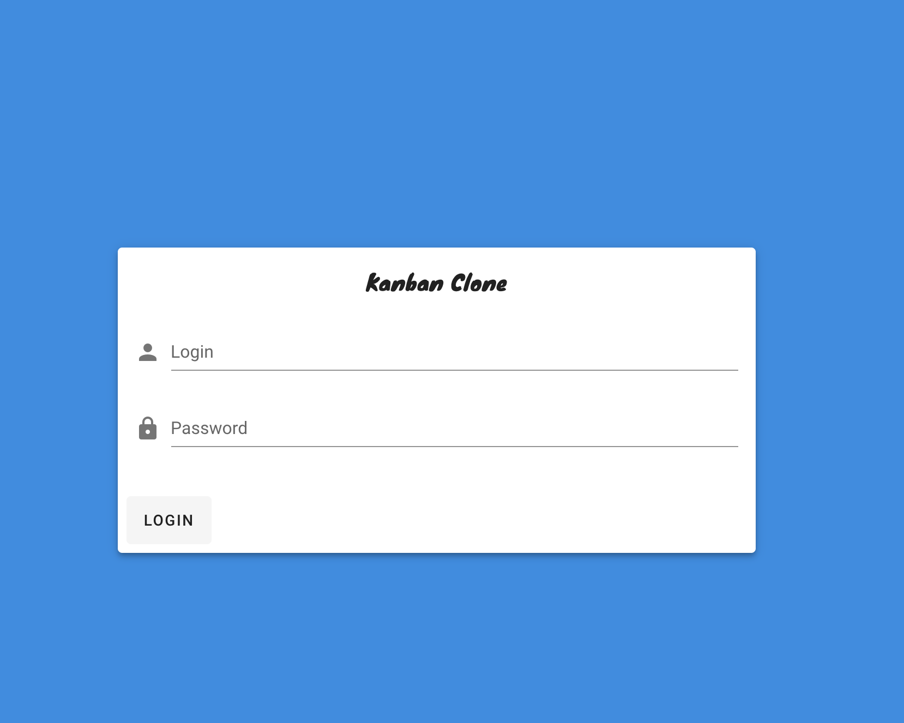
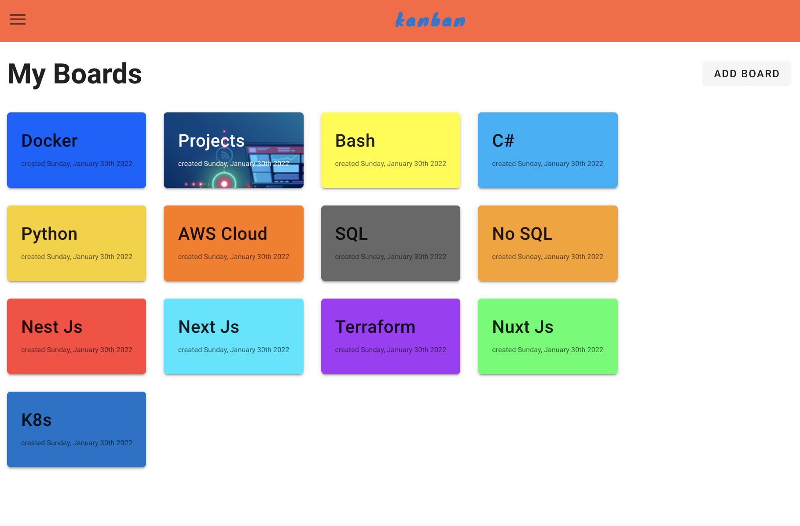
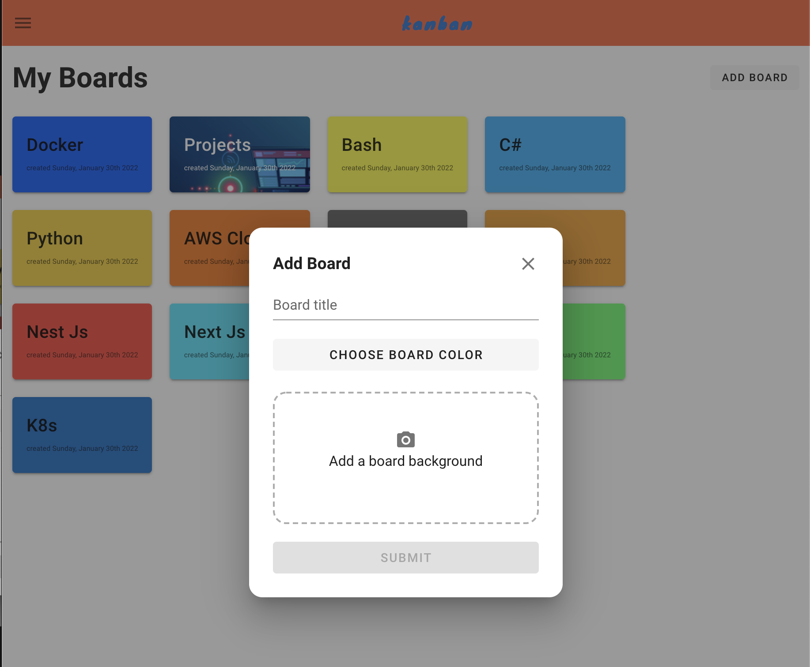
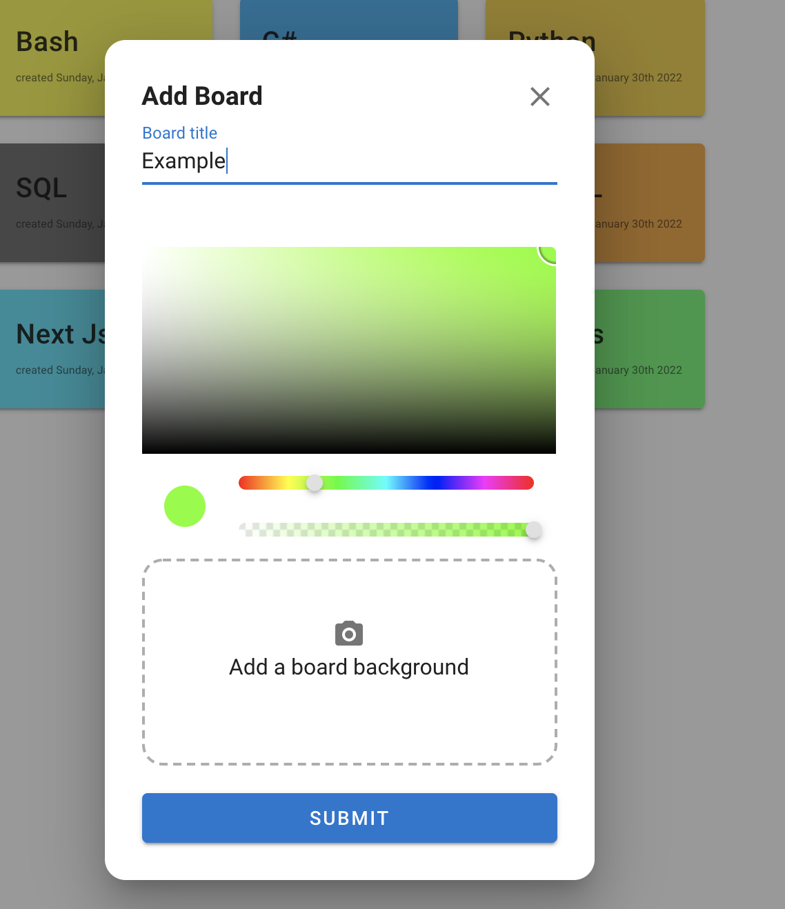
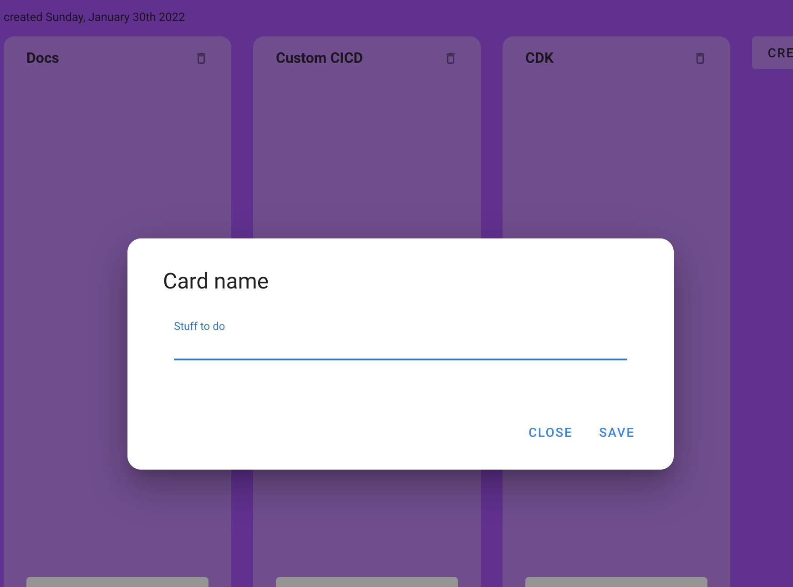
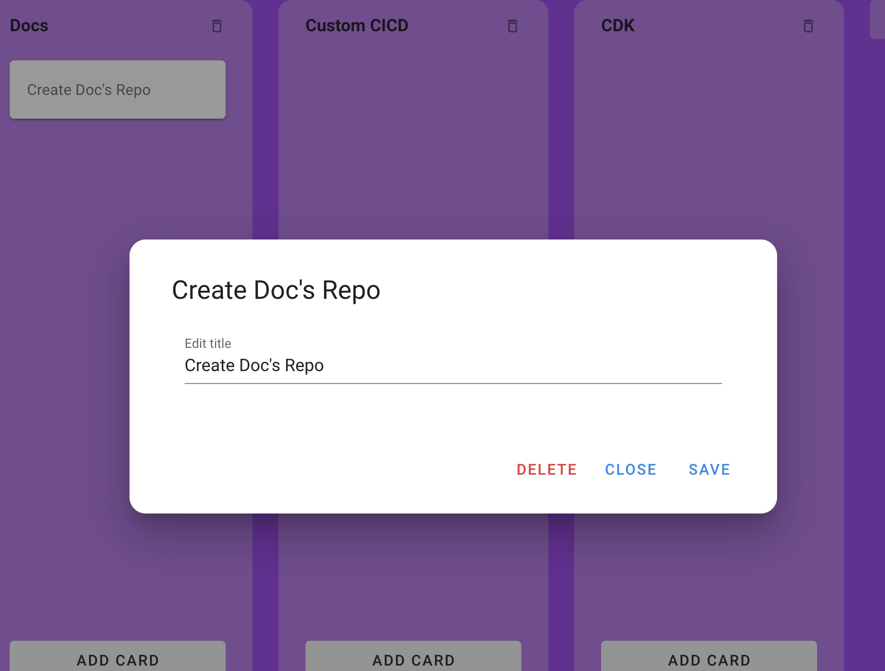
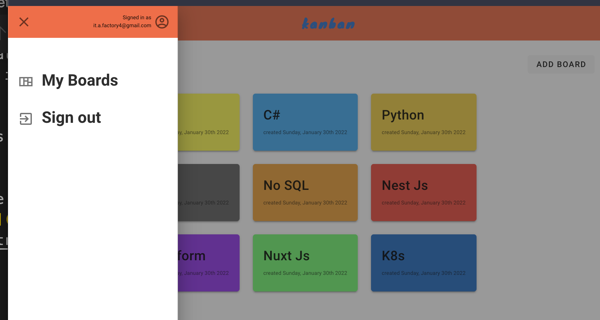

# Kanban - Clone

  This project was built using Nuxt Js, Moment, Firebase and Vuetify.

  The main objective of this project was to implement basic crud functionality using a kanban board (like trello) the product example.
  

  ## Functionality 
  User's can login and sign out. 
  User's can create boards and cards within those boards once signed in.

  They can also upload background images to these boards and delete them as needed.

  They can edit or delete the cards within the boards as well.

  I will be adding the sign up functionally as my next feature.

  ## UI 
---
#### login
  
#### Hompage
  
#### Add Boards
  
#### Add Color to Boards
  
#### Image Board
  
#### Create Cards
  
#### Edit Cards
  
#### Nav
